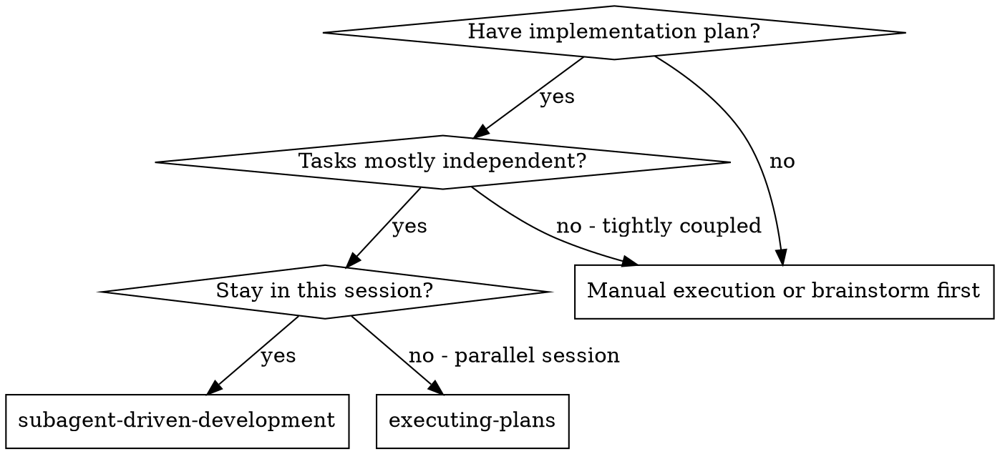
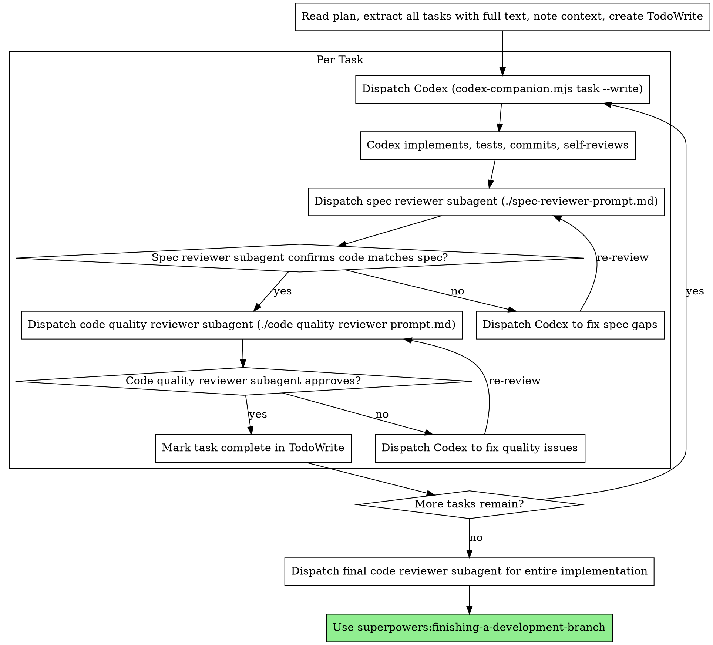

# Subagent-Driven Development

Execute plan by dispatching fresh Codex invocation per task, with two-stage review after each: spec compliance review first, then code quality review.

**Why subagents:** You delegate tasks to specialized agents with isolated context. By precisely crafting their instructions and context, you ensure they stay focused and succeed at their task. They should never inherit your session's context or history — you construct exactly what they need. This also preserves your own context for coordination work.

**Core principle:** Fresh Codex invocation per task + two-stage review (spec then quality) = high quality, fast iteration

**Implementer = Codex** (via `codex-companion.mjs task --write`). Reviewers = Claude Explore subagents. Claude (controller) handles anything requiring network access.

## When to Use



**vs. Executing Plans (parallel session):**
- Same session (no context switch)
- Fresh Codex invocation per task (no context pollution)
- Two-stage review after each task: spec compliance first, then code quality
- Faster iteration (no human-in-loop between tasks)

## The Process



## Codex as Implementer

Codex runs via `codex-companion.mjs task --write`. The `--write` flag gives Codex **workspace-write sandbox**: it can read/write all files in the working directory and run shell commands, but has **no network access**.

### Sandbox constraints

| Operation | Allowed? |
|-----------|----------|
| Read/write files in workspace | ✅ Yes |
| Run tests, compile, lint | ✅ Yes |
| git add/commit | ✅ Yes |
| npm install / npx | ❌ No (network blocked) |
| External API calls | ❌ No (network blocked) |

**Rule:** If a task needs npm packages or other network operations, Claude (controller) handles those steps first, then dispatches Codex only for the file-writing steps.

### How to dispatch Codex

```
codex-companion.mjs task --write "<detailed prompt>"
```

Codex does not inherit your session context. The prompt must be **fully self-contained**:
- Include the exact task spec (copy from plan, do not say "read the plan")
- Include relevant file contents inline (copy-paste, not file paths to read)
- Include project context (framework, conventions, directory structure)
- Include what files to create/modify and their exact expected shape
- Include how to verify success (test command, lint command)

### Handling Codex status

Codex reports one of four statuses. Handle each appropriately:

**DONE:** Proceed to spec compliance review.

**DONE_WITH_CONCERNS:** Codex completed the work but flagged doubts. Read the concerns before proceeding. If they're about correctness or scope, address them before review. If they're observations (e.g., "this file is getting large"), note them and proceed to review.

**NEEDS_CONTEXT:** Codex needs information not in the prompt. Add the missing context and re-dispatch.

**BLOCKED:** Codex cannot complete the task. Assess the blocker:
1. **Network issue** (npm install, npx, API): Claude (controller) handles the network step, then re-dispatch Codex for file work
2. **Context problem**: add more context and re-dispatch Codex
3. **Task too large**: break it into smaller pieces, dispatch Codex per piece
4. **Plan is wrong**: escalate to the human

**Never** ignore a BLOCKED status or re-dispatch Codex identically without changing something.

## Prompt Templates

- `./implementer-prompt.md` - Template for Codex task prompt
- `./spec-reviewer-prompt.md` - Dispatch spec compliance reviewer subagent
- `./code-quality-reviewer-prompt.md` - Dispatch code quality reviewer subagent

## Example Workflow

```
You: I'm using Subagent-Driven Development to execute this plan.

[Read plan file once: docs/superpowers/plans/feature-plan.md]
[Extract all 5 tasks with full text and context]
[Create TodoWrite with all tasks]

Task 1: Hook installation script

[Get Task 1 text and context (already extracted)]
[Dispatch Codex via codex-companion.mjs task --write with full task text + context inline]

Codex: DONE
  - Implemented install-hook command
  - Added tests, 5/5 passing
  - Self-review: Found I missed --force flag, added it
  - Committed

[Dispatch spec compliance reviewer]
Spec reviewer: ✅ Spec compliant - all requirements met, nothing extra

[Get git SHAs, dispatch code quality reviewer]
Code reviewer: Strengths: Good test coverage, clean. Issues: None. Approved.

[Mark Task 1 complete]

Task 2: Recovery modes

[Get Task 2 text and context (already extracted)]
[Dispatch Codex with full task text + context inline]

Codex: DONE
  - Added verify/repair modes
  - 8/8 tests passing
  - Self-review: All good
  - Committed

[Dispatch spec compliance reviewer]
Spec reviewer: ❌ Issues:
  - Missing: Progress reporting (spec says "report every 100 items")
  - Extra: Added --json flag (not requested)

[Dispatch Codex to fix: remove --json flag, add progress reporting]
Codex: DONE - removed --json flag, added progress reporting

[Spec reviewer reviews again]
Spec reviewer: ✅ Spec compliant now

[Dispatch code quality reviewer]
Code reviewer: Strengths: Solid. Issues (Important): Magic number (100)

[Dispatch Codex to fix: extract PROGRESS_INTERVAL constant]
Codex: DONE

[Code reviewer reviews again]
Code reviewer: ✅ Approved

[Mark Task 2 complete]

...

[After all tasks]
[Dispatch final code-reviewer]
Final reviewer: All requirements met, ready to merge

Done!
```

## Advantages

**vs. Manual execution:**
- Codex follows TDD naturally
- Fresh context per task (no confusion)
- No confirmation prompts (`--write` sandbox)
- Faster file operations than interactive editing

**vs. Executing Plans:**
- Same session (no handoff)
- Continuous progress (no waiting)
- Review checkpoints automatic

**Efficiency gains:**
- No file reading overhead (controller provides full text inline)
- Controller curates exactly what context is needed
- Codex gets complete information upfront
- `--write` sandbox eliminates all approval prompts

**Quality gates:**
- Self-review catches issues before handoff
- Two-stage review: spec compliance, then code quality
- Review loops ensure fixes actually work
- Spec compliance prevents over/under-building
- Code quality ensures implementation is well-built

**Cost:**
- More invocations (Codex + 2 reviewers per task)
- Controller does more prep work (extracting all tasks upfront)
- Review loops add iterations
- But catches issues early (cheaper than debugging later)

## Red Flags

**Never:**
- Start implementation on main/master branch without explicit user consent
- Skip reviews (spec compliance OR code quality)
- Proceed with unfixed issues
- Dispatch multiple Codex invocations in parallel (conflicts)
- Tell Codex to "read the plan file" — provide full text inline in the prompt
- Skip scene-setting context (Codex needs to understand where task fits)
- Accept "close enough" on spec compliance (spec reviewer found issues = not done)
- Skip review loops (reviewer found issues = Codex fixes = review again)
- Let Codex self-review replace actual review (both are needed)
- **Start code quality review before spec compliance is ✅** (wrong order)
- Move to next task while either review has open issues
- Dispatch Codex for network operations (npm install, npx, API calls) — Claude handles those

**If Codex is BLOCKED on network:**
- Claude (controller) runs the network step (e.g., `npm install <pkg>`)
- Then re-dispatch Codex for the file-writing portion

**If reviewer finds issues:**
- Dispatch Codex again with specific fix instructions
- Reviewer reviews again
- Repeat until approved
- Don't skip the re-review

**If Codex fails task:**
- Dispatch Codex again with more specific instructions
- Don't try to fix manually (context pollution)

## Integration

**Required workflow skills:**
- **superpowers:using-git-worktrees** - REQUIRED: Set up isolated workspace before starting
- **superpowers:writing-plans** - Creates the plan this skill executes
- **superpowers:requesting-code-review** - Code review template for reviewer subagents
- **superpowers:finishing-a-development-branch** - Complete development after all tasks

**Subagents should use:**
- **superpowers:test-driven-development** - Codex follows TDD for each task

**Alternative workflow:**
- **superpowers:executing-plans** - Use for parallel session instead of same-session execution
